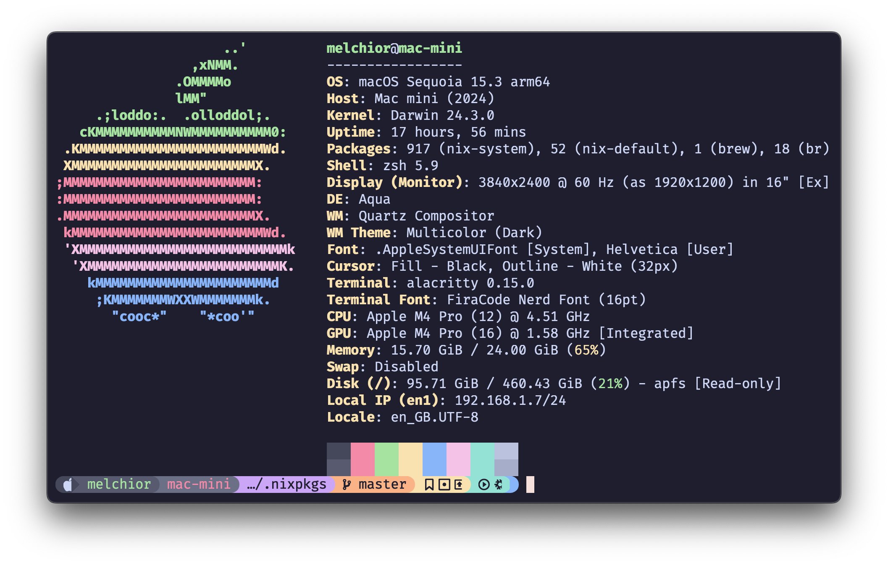

<h1 align="center">
    <code>Nix System Config &amp; Dotfiles</code>
</h1>

<a href="docs/img/terminal.png">
    
</a>

This repository manages system configurations for macOS (via **nix-darwin**) and Linux (via standalone **home-manager**). All configurations are defined as a [Nix flake](https://nixos.wiki/wiki/Flakes).

## 🧠 Philosophy

- `nix-darwin` and `home-manager` configurations are **decoupled** — both can be used independently.
- `home-manager` is embedded as a module inside `nix-darwin` for macOS (via `common.nix`), but runs as a fully standalone tool on Linux.
- `sysdo` — a Python CLI in `bin/do.py` — is the single entry point for all system management operations. It auto-detects the platform (Darwin / NixOS / Linux home-manager) so most commands work without extra flags.

## 🖥️ Configured Hosts

| Flake attribute | Platform | Username | Hostname | Notes |
|---|---|---|---|---|
| `melchior@aarch64-darwin` | macOS (Apple Silicon) | `melchior` | `mac-mini` | nix-darwin + home-manager |
| `richban@x86_64-linux` | Linux x86_64 | `richban` | `SKB58713` | standalone home-manager; flake at `~/.config/system` |

---

## ⚙️ Prerequisites — Install Nix

Run the Determinate Systems installer on any machine before anything else:

```bash
curl --proto '=https' --tlsv1.2 -sSf -L https://install.determinate.systems/nix | sh -s -- install
```

---

## 🚀 Bootstrapping

### macOS (nix-darwin)

Clone the repo and run the bootstrap command. `sysdo bootstrap` handles disk setup (`/etc/synthetic.conf`, `/run` symlink), builds the Darwin system closure, and activates it.

```bash
git clone https://github.com/richban/system ~/.nixpkgs
cd ~/.nixpkgs

# Bootstrap — auto-detects Darwin, defaults to melchior@aarch64-darwin
nix run .#sysdo bootstrap

# Or specify the host explicitly
nix run .#sysdo bootstrap melchior@aarch64-darwin
```

### Linux (standalone home-manager)

The flake repo must be cloned to `~/.config/system` on the Linux machine (this is required for the live nvim config symlink and shell functions to resolve correctly).

```bash
git clone https://github.com/richban/system ~/.config/system
cd ~/.config/system

# Bootstrap — installs home-manager and activates the profile in one step
nix run .#sysdo bootstrap richban@x86_64-linux

# Alternatively, drive home-manager directly (if sysdo is not yet available)
nix run --experimental-features "nix-command flakes" \
    github:nix-community/home-manager -- switch \
    --flake ~/.config/system#richban@x86_64-linux \
    -b backup
```

---

## 🛠️ `sysdo` Commands

`sysdo` is available in two ways:
- **Inside the dev shell**: just `sysdo <command>`
- **From anywhere**: `nix run .#sysdo <command>`
- **Without a local clone**: `nix run github:richban/system#sysdo <command>`

### `bootstrap` — First-time setup

Builds the initial system closure and activates it. On Darwin it also handles disk setup.

```bash
# macOS — auto-detected, uses default host
nix run .#sysdo bootstrap

# macOS — explicit host
nix run .#sysdo bootstrap melchior@aarch64-darwin

# Linux — explicit host (no darwin-rebuild present on Linux)
nix run .#sysdo bootstrap richban@x86_64-linux

# Build from the remote flake instead of local checkout
nix run .#sysdo bootstrap melchior@aarch64-darwin --remote
```

### `switch` — Build & activate

The everyday update command. Rebuilds the configuration and activates it immediately.

```bash
# macOS — auto-detected
nix run .#sysdo switch

# macOS — explicit host
nix run .#sysdo switch melchior@aarch64-darwin

# Linux — auto-detected on non-Darwin systems
nix run .#sysdo switch richban@x86_64-linux

# Force a specific platform type
nix run .#sysdo switch melchior@aarch64-darwin --darwin
nix run .#sysdo switch richban@x86_64-linux --home-manager

# Apply from the published remote flake (no local clone needed)
nix run .#sysdo switch melchior@aarch64-darwin --remote
```

### `build` — Build without activating

Builds the derivation and leaves a `./result` symlink. Use this to validate changes before applying.

```bash
# macOS
nix run .#sysdo build melchior@aarch64-darwin

# Linux
nix run .#sysdo build richban@x86_64-linux
```

### `update` — Update flake inputs

```bash
# Update all inputs
nix run .#sysdo update

# Update a single input
nix run .#sysdo update --flake nixpkgs
nix run .#sysdo update --flake home-manager
nix run .#sysdo update --flake neovim-nightly-overlay

# Commit the updated lockfile automatically
nix run .#sysdo update --commit
```

### `gc` — Garbage collection

```bash
# Remove store paths older than 30 days
nix run .#sysdo gc --delete-older-than 30d

# Dry run — preview what would be removed
nix run .#sysdo gc --delete-older-than 14d --dry-run
```

### `clean` — Remove build result symlinks

```bash
# Remove the default ./result symlink
nix run .#sysdo clean

# Remove all result symlinks in the current directory
nix run .#sysdo clean '*'
```

### `pull` — Pull latest changes

Stashes local changes, pulls from remote, and re-applies the stash.

```bash
nix run .#sysdo pull
```

### `cache` — Push derivations to Cachix

```bash
nix run .#sysdo cache richban
```

---

## 🔧 Development Workflow

```bash
# Enter the dev shell (nixd, fd, ripgrep, uv + pre-commit hooks wired in)
nix develop

# Format all Nix files
nix fmt

# Run all checks — pre-commit hooks + build activation packages for all hosts
nix flake check

# Build specific flake outputs directly
nix build .#darwinConfigurations."melchior@aarch64-darwin".config.system.build.toplevel
nix build .#homeConfigurations."melchior@aarch64-darwin".activationPackage
nix build .#homeConfigurations."richban@x86_64-linux".activationPackage
```

### Pre-commit hooks

Hooks run automatically inside the dev shell and during `nix flake check`:

| Hook | Purpose |
|---|---|
| `alejandra` | Nix code formatting |
| `black` | Python formatting (`bin/do.py`) |
| `shellcheck` | Shell script linting |
| `stylua` | Lua formatting (Neovim configs) |
| `deadnix` | Dead Nix code removal |
