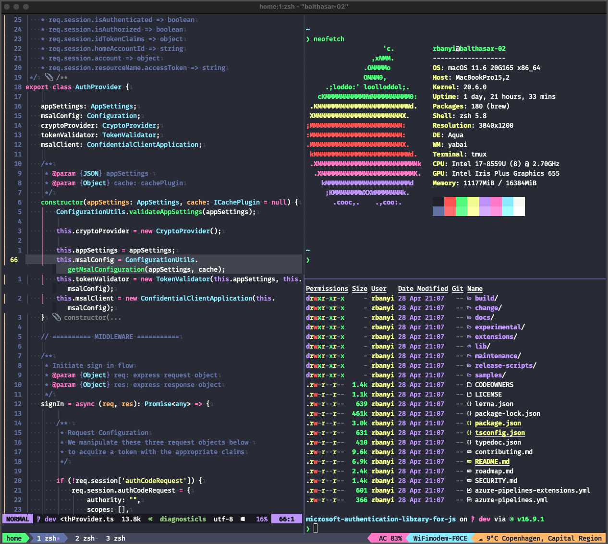

<h1 align="center">
    <code>.dotfiles</code>
</h1>

#### Terminal

- [Zsh](https://www.zsh.org/) shell with [zinit](https://github.com/zdharma-continuum/zinit) plugin manager
- [Alacritty](https://github.com/alacritty/alacritty) terminal emulator
- [enhancd](https://github.com/b4b4r07/enhancd) fuzzy-search and `cd` directories
- [tmux](https://github.com/tmux/tmux) terminal multiplexer
- [Dracula](https://draculatheme.com/) theme

#### Editor

- [Neovim](https://github.com/neovim/neovim)
  - LSPs (Python, JavaScript/TypeScript, SQL etc.)
  - Snippets
  - Gitsigns

#### Window Manager

- [yabai](https://github.com/koekeishiya/yabai) tiling window manager
- [skhd](https://github.com/koekeishiya/skhd) hotkey deamon to control `yabai`
- [simple-bar](https://www.simple-bar.com/) an `Übersicht` status bar widget for `yabai`

#### Dotfile Manager

- [Dotdrop](https://dotdrop.readthedocs.io/en/latest/) dotfiles manager that installs dotfiles and profiles:
  - `zsh` configure `zsh`, aliases, functions, theme etc.
  - `win_manager` configure `yabai` window manager
  - `neovim` installs neovim, LSPs, packer plugin neovim manager
  - `python` install python development environment: `poetry`, `pyenv`, `pipenv` and other python specific tools like `pylsp`, `black`, `isort` etc.
